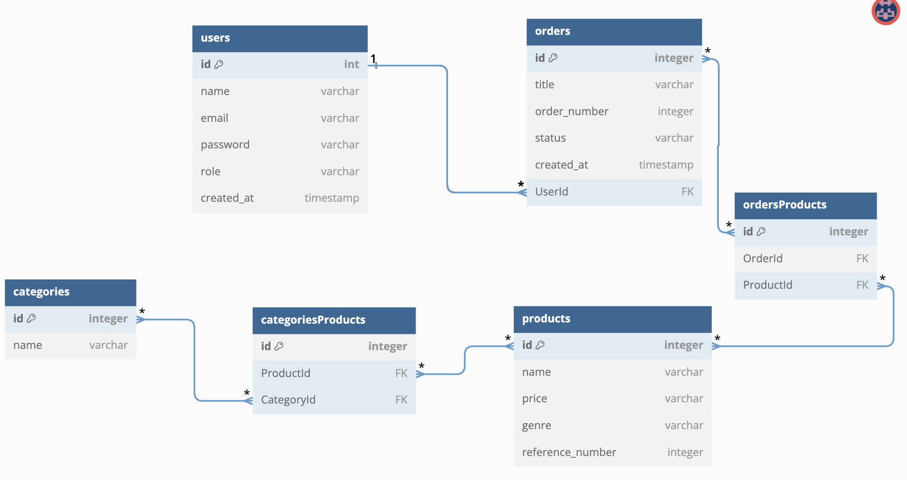
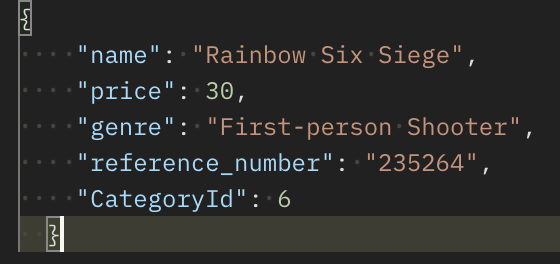
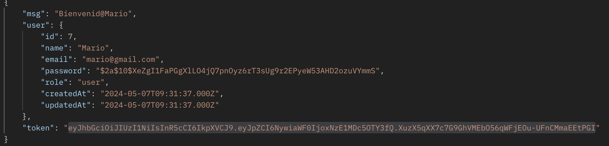

# PROYECTO E-COMMERS

## Descripción

Este proyecto de Backend demuestra los conocimientos adquiridos en Node.js, Express.js, Sequelize y MySQL. El ejercicio propuesto consiste en una aplicación de comercio electrónico basada en videojuegos, donde se aplicarán los operadores CRUD (create, read, update y delete) a Usuarios, Pedidos, Productos y Categorías.

## Tecnologías Utilizadas

- JavaScript
- Node.js
- Express.js
- Sequelize
- MySQL
- Bcryptjs
- jsonwebtoken

## Diagrama

Para este proyecto he creado un diagrama donde se pueden ver diferentes tablas y como se relacionan entre ellas.
- 1 a Muchos: entre la tabla de usuarios y la de pedidos.
- Muchos a Muchos: entre las tablas de pedidos y productos, las cuales se relacionan mediante una tabla intermedia llamada OrdersProducts.
- Muchos a Muchos: también tienen esta relación las tablas de productos y categorias las cuales estan unidas a traves de la tabla intermedia CategoriesProducts.

## CRUD

En informática, CRUD es el acrónimo de "Crear, Leer, Actualizar y Borrar", que se usa para referirse a las funciones básicas en bases de datos o la capa de persistencia en un software.

### CRUD Productos
- Endpoint para crear producto.
- Endpoint para actualizar el producto mediante id
- Endpoint para Borrar producto mediante id
- Endpoint para obtener los productos
- Endpoint para obtener producto mediante id
- Endpoint para obtener producto mediante nombre
- Endpoint para obtener producto mediante precio
- Endpoint para obtener una lista de productos de forma descendente por el precio

#### Ejemplo como crear un producto en Postman
A la hora de crear un producto debes poner esta ruta POST -> localhost:3001/products. 
Una vez en esta ruta debes elegir Body y marcar la opcion de JSON y crear el objeto con el producto que quieres crear.

### CRUD Pedidos
- Endpoint para crear un pedido si estas autenticado
- Endpoint para obtener los pedidos

### CRUD Categorias
- Endpoint para crear una categoría
- Endpoint para actualizar una categoría 
- Endpoint para borar una categoría mediante id
- Endpoint para obtener las categorías existentes
- Endpoint para obtener una categoria por id
- Endpoint para obtener una categoría por nombre

### CRUD usuarios
- Endpoint para crear un usuario 
- Endpoint para obtener una lista de usuarios. Solo se puede obtener si el usuario esta autenticado
- Endpoint para hacer logout. Hay que estar autenticado y logeado previamente para poder hacerlo

#### Ejemplo de login en Postman

Para hacer login hay que poner esta ruta POST -> localhost:3001/users/login

Una vez que haces login se crea un Token que podras utilizar para crear, modificar o borrar productos y también habrá que utilizarlo a la hora de hacer el logout.

## Desarrollado por:
- JAIRO NÚÑEZ

